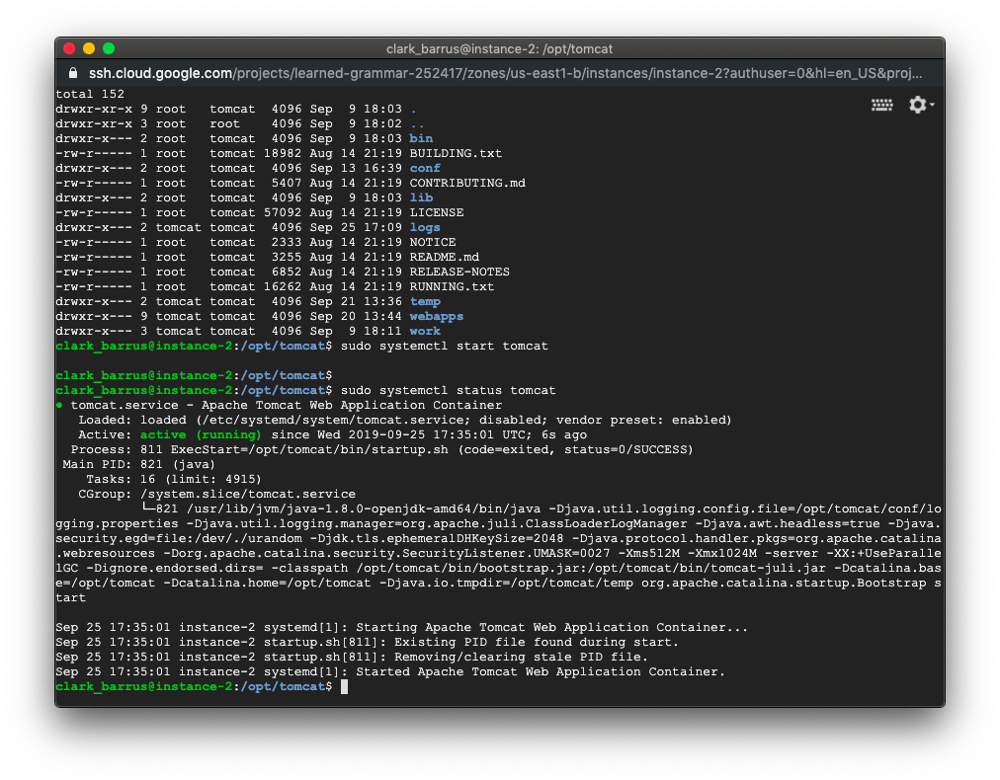
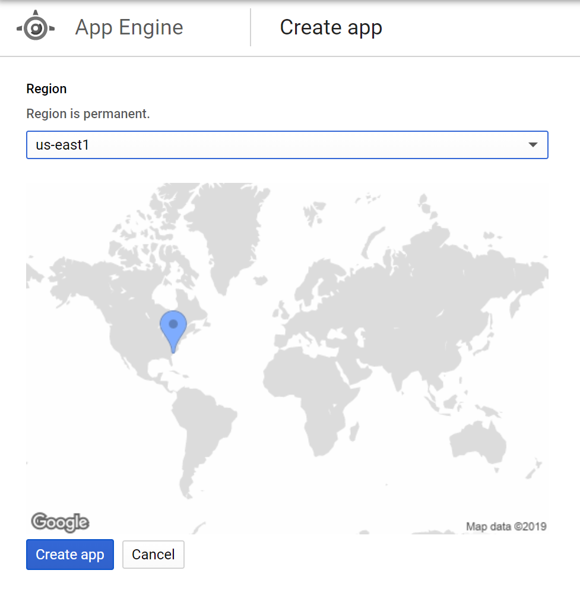

# Random Number Service Timing Project

## Service Migration

### Compute Engine
Migrating Compute Engine instances to a different region is pretty easy.

Navigate to the [Disks section](https://console.cloud.google.com/compute/disks)
of the Compute Engine console.  
  
Select the disk tied to the service to migrate and select **Create Snapshot**.  
  
Give the snapshot a name. The default options are reasonable.  
  
The snapshot should now appear in the snapshot listing.  


Now to create the VM instance in the new region. Go back to the [VM
Instances](https://console.cloud.google.com/compute/instances) view and open the
form to create a new instance.

After giving the instance a name and the desired region, click **Change** under
**Boot Disk**.  
  
Go to the **Snapshots** tab and select the snapshot made earlier.  
  
Finish making the VM instance and it should appear in the instance list.  


If the VM instance being migrated needs commands to be run or services started
after a reboot, SSH into the new instance and perform those tasks. Starting a
new VM instance from a snapshot is just like a very complicated reboot.  


But that's it. And if the VM instance has boot tasks configured to bring the
service up automatically, the only two steps in the migration process are to
make a snapshot and make a new instance from that snapshot.

### App Engine
Google Cloud Platform doesn't support moving App Engine instances or snapshots.
App Engine is automatically scaled across multiple regions by Google, so
manually moving to a new region requires a separate project and a separate application.

After creating a new project, navigate to the [App
Engine](https://console.cloud.google.com/appengine/) view and create a new
project in the desired region. Choose wisely, because it can't be changed later.  


Ideally the application code would be hosted in some external repository that
can be quickly cloned and deployed into the new GCP project. Then all that is
required is cloning the application code and running `gcloud app deploy`.  


## Timing Results
```
104.222.25.33: us-east1_b_vm_python@http://35.237.232.176 0.10912871360778809s 263080
104.222.25.33: us-east1_b_vm_java@http://35.196.181.146:8080/randnum/hello 0.10913777351379395s 505067
104.222.25.33: asia-northeast1_a_app_python@http://regions-254017.appspot.com/ 0.20650649070739746s 980349
104.222.25.33: asia-northeast1_a_vm_python@http://34.84.95.192 0.288053035736084s 618221
104.222.25.33: asia-south1_c_appengine_python@https://timing-experiment-cs4263.appspot.com/ 1.882603406906128s 698866
104.222.25.33: asia-northeast1_a_app_java@https://glass-pen-254017.appspot.com 0.11513257026672363s InvalidResponse
104.222.25.33: asia-south-1_a_vm_java@http://34.93.76.51:8080/rng/ 0.5422666072845459s 75950
104.222.25.33: asia-northeast1_b_vm_java@http://34.85.71.249:8080/random/hello.jsp 0.2910618782043457s InvalidResponse
104.222.25.33: australia-southeast1_b_vm_java@http://35.189.39.14/randnum/randnum 0.3634986877441406s 678533
104.222.25.33: australia-southeast1_b_vm_python@http://35.189.43.96:5000 2.88804030418396s ConnectionError
104.222.25.33: australia-southeast1_b_app_java@http://galvanic-ward-254017.appspot.com 1.2884318828582764s 354549
104.222.25.33: australia-southeast1_b_app_python@http://python-aus.appspot.com/ 1.276360034942627s 660703
104.222.25.33: asia-south1_c_app_java@http://team-23-asia-southeast.appspot.com/ 0.04808473587036133s InvalidResponse
104.222.25.33: asia-southeast1_b_vm_python@http://34.87.23.44:5000/ 3.0113909244537354s ConnectionError
104.222.25.33: asia-northeast2_a_vm_java@http://34.97.51.216:8080/number.jsp 0.3022017478942871s InvalidResponse
104.222.25.33: europe-north1_c_vm_python@http://35.228.86.47:5000/ 0.3235514163970947s 834135
104.222.25.33: asia-northeast2_a_app_python@http://rng-python-asiane2.appspot.com 0.08121609687805176s InvalidResponse
104.222.25.33: asia-east2_c_vm_python@http://35.220.136.215/ 0.37087059020996094s 785050
104.222.25.33: asia-southeast1_a_vm_python@http://34.87.17.67/python/ 0.47112464904785156s 297945
104.222.25.33: asia-southeast1_a_vm_java@http://34.87.17.67/java/RandGen.shtml 0.47263145446777344s 854466
104.222.25.33: asia-south1_c_appengine_java@http://region-change.appspot.com/demo 0.3317539691925049s 355050
104.222.25.33: southeast-australia-1_c_appengine_python@https://cs-4263-1.appspot.com/ 1.3369596004486084s 99280
104.222.25.33: asia-northeast_2a_vm_python@http://34.97.25.195 0.5003254413604736s 904569
104.222.25.33: asia-east2_app_python@https://cs4263-rngtiming.appspot.com/ 1.265146255493164s 665621
104.222.25.33: asia-east2_app_java@https://javaproject1-254017.appspot.com/ 0.1060948371887207s InvalidResponse
104.222.25.33: asia-east2_vm_python@http://35.220.136.215/ 0.36887168884277344s 494784
104.222.25.33: asia-east2_vm_java@http://35.220.136.215/ 0.37052083015441895s 387653
104.222.25.33: southamerica-east1_a_app_python@https://timing-experiment-sa-zonea.appspot.com/ 1.1359682083129883s 835153
104.222.25.33: southamerica-east1_a_app_java@https://timing-experiment-sa-java.appspot.com/demo 1.1013920307159424s 191288
104.222.25.33: europe-west3_b_app_python@http://radom-timing-experiment.appspot.com 0.18097972869873047s 723309
104.222.25.33: europe-west3_b_app_java@http://java-dot-radom-timing-experiment.appspot.com 0.18295073509216309s 913483
104.222.25.33: europe-west3_b_vm_java@http://35.246.243.145 0.2737762928009033s 770998
104.222.25.33: europe-west3_b_vm_python@http://35.234.125.152 0.2717885971069336s 26615
104.222.25.33: europe-west6-a_vm_java_@http://34.65.30.164 2.6995036602020264s ConnectionError
104.222.25.33: southamerica-east1_a_vm_python@http://34.95.171.137/ 0.3107786178588867s 744457
104.222.25.33: europe-west4_a_vm_python@http://35.204.2.146/ 0.2689638137817383s 801674
104.222.25.33: asia-south1_a_vm_python@http://34.93.13.81:8000/ 0.5299627780914307s 106447
104.222.25.33: europe-west3_a_app_python@https://python-ae-test.appspot.com/ 0.879889965057373s 796847
104.222.25.33: europe-west3_a_vm_python@http://35.242.194.148/ 0.27275919914245605s 992093
104.222.25.33: europe-west3_a_app_java@https://glassy-droplet-254017.appspot.com 0.9084305763244629s InvalidResponse
104.222.25.33: europe-west3_a_vm_java@http://35.198.133.185/Servlets/RandomNumberGen 0.2752103805541992s 749710
104.222.25.33: europe-west2_a_vm_java@http://35.242.148.119/javarng 0.24892878532409668s 572042
104.222.25.33: europe-west2_a_vm_python@http://35.242.148.119/pythonrng 0.2436842918395996s 726443
104.222.25.33: europe-west2_a_app_java@https://javarng-dot-universal-helix-254016.appspot.com/ 0.7815492153167725s 168938
104.222.25.33: europe-west2_a_app_python@https://pythonrng-dot-universal-helix-254016.appspot.com/ 0.761939287185669s 6175
104.222.25.33: us-central1_a_app_python@https://agile-genius-254017.appspot.com 0.13507914543151855s 579121
104.222.25.33: us-central1_a_app_java@http://random-num-generator-java.appspot.com/ 0.08754897117614746s 339195
104.222.25.33: us-central1_a_vm_python@http://34.67.208.90:5000 0.07220125198364258s 555069
104.222.25.33: us-central1_a_vm_java@http://35.232.76.156:8080/randomnum/rnd.jsp 0.07117795944213867s 577759
104.222.25.33: us-west1_a_vm_python@http://35.197.97.54/Project 0.10920858383178711s 975321
104.222.25.33: us-east4-a_vm_java_@http://35.245.249.223:8080/javaapp-1.0-SNAPSHOT/ 0.0982353687286377s InvalidResponse
104.222.25.33: us-east4_app_java_@https://java-east.appspot.com/ 0.3023707866668701s InvalidResponse
104.222.25.33: us-east4-a_vm_python_@http://35.236.251.120:5000/ 0.13651037216186523s InvalidResponse
104.222.25.33: us-east4_app_python_@https://distributed-inn-254017.appspot.com/ 0.2491745948791504s InvalidResponse
104.222.25.33: europe-west2_b_vm_python@http://34.89.105.129/ 0.24629998207092285s InvalidResponse
104.222.25.33: us-central_c_app_java@http://software-engineering-4263.appspot.com/randomnumber 0.08096790313720703s 907538
104.222.25.33: europe-west3_c_app_python@https://xenon-blade-254017.appspot.com/ 0.855125904083252s 718529
104.222.25.33: asia-east1_b_vm_python@https://eastasia.mag-i-c.com/ 0.5636227130889893s 838582
104.222.25.33: asia-east1_b_vm_java@http://eastasiajava.mag-i-c.com/ 0.3954892158508301s 351978
104.222.25.33: asia-east2_*_app_python@https://adept-storm-254017.appspot.com/ 1.2386085987091064s 800620
104.222.25.33: asia-east2_*_app_java@https://timing-experiment-2.appspot.com/ 1.2780475616455078s 257595
104.222.25.33: europe-west6_a_vm_java@http://34.65.233.205:8080/Rng/giveme 0.28884100914001465s InvalidResponse
104.222.25.33: europe-west6_a_app_java@https://20190925t131126-dot-green-network-254018.appspot.com/rnd 0.8996562957763672s InvalidResponse
104.222.25.33: asia-south1_a_app_java@https://javaappexperiment.appspot.com 1.857633113861084s InvalidResponse
104.222.25.33: asia-south1_a_app_python@https://graphite-hook-254021.appspot.com/ 0.35339951515197754s 44477
104.222.25.33: us-west2_us-west2-a_vm_python@http://35.236.38.77/vm/python.py 0.12648248672485352s 598517
104.222.25.33: us-west2_us-west2-a_vm_java@http://35.236.38.77/vm/java.sh 0.196364164352417s 609126
104.222.25.33: us-west2_us-west2-a_app_python@https://pyapp-254017.appspot.com/ 0.4707765579223633s 909907
104.222.25.33: us-west2_us-west2-a_app_java@https://javaapp-3298719.appspot.com/ 0.3603839874267578s 241599
104.222.25.33: europe-west6_a_vm_python@http://34.65.60.226 0.4881865978240967s 661447
104.222.25.33: europe-north1_a_app_java@https://timing-experiment-254017.appspot.com/ 0.09764885902404785s InvalidResponse
104.222.25.33: europe-west6_a_app_python@http://vivid-memento-254504.appspot.com 0.2644369602203369s 538804
104.222.25.33: us-west1_a_app_python@http://ip-timing.appspot.com/ 0.08657336235046387s 659923
104.222.25.33: europe-west1_b_app_python@http://timing-experiment.appspot.com/ 0.7667787075042725s 648408
104.222.25.33: europe-west1_b_app_java@http://random-timing.appspot.com 0.4781765937805176s 438058
104.222.25.33: europe-west1_b_vm_java@http://35.195.133.24:8000 0.42154717445373535s 659391
104.222.25.33: europe-west1_b_vm_python@http://35.195.133.24:8080 0.2578315734863281s 841095
104.222.25.33: asia-south1_b_app_python@https://melodic-lantern-252322.appspot.com/ 0.13869595527648926s 637477
104.222.25.33: asia-south1_b_vm_python@https://python-compute-252322.appspot.com/ 0.13911819458007812s 909411
104.222.25.33: asia-south1_b_app_java@https://random-number-generator-251217.appspot.com/ 0.15084505081176758s 316769
104.222.25.33: asia-south1_b_vm_java@http://35.239.94.178:8080/ 0.07113456726074219s 628814
104.222.25.33: europe-north1_b_vm_java@http://35.228.170.187/ 0.3252999782562256s 852522
104.222.25.33: europe-west2_c_app_python@http://voltaic-azimuth-254421.appspot.com/ 0.17600679397583008s 940276
104.222.25.33: northamerica-northeast1_a_app_python@https://a-project-made-of-time.appspot.com/ 0.3497776985168457s 696372
104.222.25.33: europe-west6_a_app_python@https://project1-2-254017.appspot.com/ 0.9324216842651367s 625947
104.222.25.33: us-east1_b_app_python@https://pythonae-east.appspot.com/ 0.34928202629089355s 998387
104.222.25.33: us-east1-b-app-java@http://airy-web-254017.appspot.com/demo 0.11601924896240234s 751805
104.222.25.33: europe-west2_b_app_python@https://python-app-new-server.appspot.com/ 0.763214111328125s InvalidResponse
104.222.25.33: europe-west2_b_app_java@http://35.246.72.72:8080/javarand/MyServlet 0.2507040500640869s InvalidResponse
104.222.25.33: us-central1_a_vm_java@http://35.225.166.187:8080/rng/ 0.06947755813598633s 653856
104.222.25.33: us-central1_a_vm_python@http://35.225.166.187/ 0.07062387466430664s 176425
104.222.25.33: australia-southeast1_a_vm_python@http://35.244.66.146:5000 0.3654611110687256s InvalidResponse
104.222.25.33: australia-southeast1_a_app_python@http://timing-experiment-flask.appspot.com/ 1.2736032009124756s InvalidResponse
104.222.25.33: australia-southeast1_a_app_java@http://randomnumzonea.appspot.com/ 0.05403757095336914s InvalidResponse
104.222.25.33: asia-northeast-1_b_vm_java@http://35.221.85.9:8080/rng/ 0.2944214344024658s 366452
104.222.25.33: asia-northeast-1_b_vm_python@http://http://35.221.85.9/ 0.061933040618896484s ConnectionError
104.222.25.33: europe-west_c_app_java@https://t0925-254018.appspot.com 0.10542535781860352s InvalidResponse
104.222.25.33: europe-west3_c_app_java@https://randomtiming.appspot.com/ 0.0860748291015625s InvalidResponse
104.222.25.33: europe-north1-a_vm_python@http://35.228.182.58:8000/randomNumber/ 0.5165834426879883s 631956
104.222.25.33: asia-northeast2_a_app_java@https://number-254315.appspot.com/hello 0.13530516624450684s 964703
104.222.25.33: europe-west1_app_java@https://composed-anvil-254017.appspot.com/demo 0.21705985069274902s 54434
104.222.25.33: europe-west1_app_python@https://cs4263-test.appspot.com 0.8139560222625732s 835884
104.222.25.33: europe-west1_instance_java@http://34.77.239.200:5000/ 0.25359296798706055s 55619
104.222.25.33: europe-west1_instance_python@http://35.238.165.97:5000/ 0.07211804389953613s 303205
104.222.25.33: asia-south2_a_app_java@https://randn-254517.appspot.com/hello 1.0169084072113037s 43230
104.222.25.33: asia-northeast2_a_app_java@https://randn-254517.appspot.com/hello 1.0759761333465576s 564019
104.222.25.33: europe-north1_a_vm_java@http://35.228.200.95/examples/servlets/servlet/HelloWorldExample 0.32430171966552734s InvalidResponse
104.222.25.33: asia-east2_a_vm_java@http://34.92.91.211:8080/random-gcp/random.jsp 0.3849012851715088s 889718
104.222.25.33: asia-east2_a_app_java@http://software-engineering-i-2.appspot.com/demo 1.3260021209716797s 846356
104.222.25.33: asia-east2_a_vm_python@http://35.220.139.138:5000/ 0.371837854385376s 333787
104.222.25.33: asia-east2_a_app_python@http://experimentproject-254019.appspot.com/ 0.24368858337402344s 334758
104.222.25.33: east-asia1_a_app_python@https://asian-four-men-one-shell.appspot.com 1.288231611251831s 114231
104.222.25.33: east-asia1_a_vm_python@http://www.qazwsxedc.gq/ 0.3788766860961914s 924795
```
